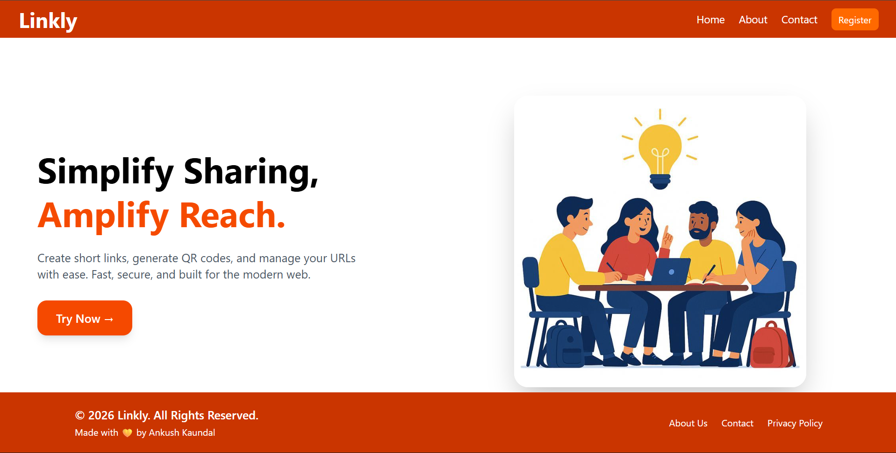
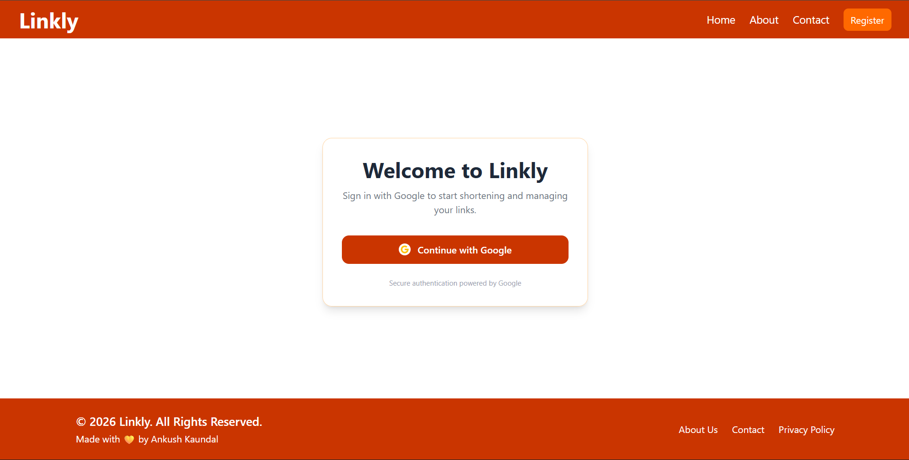
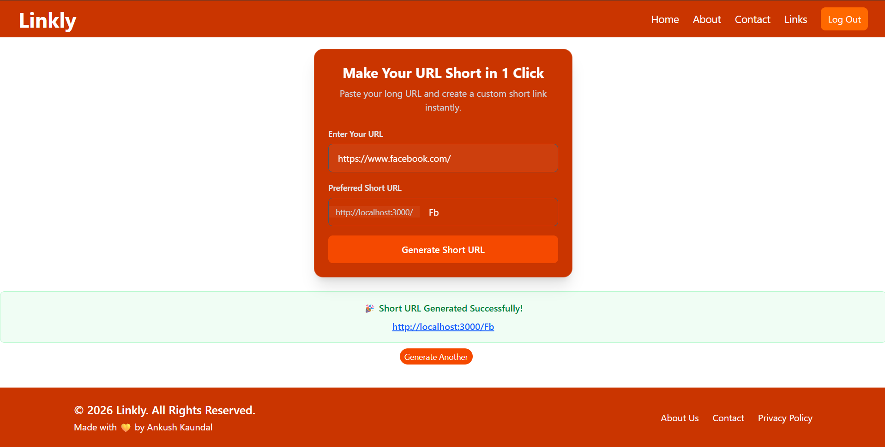
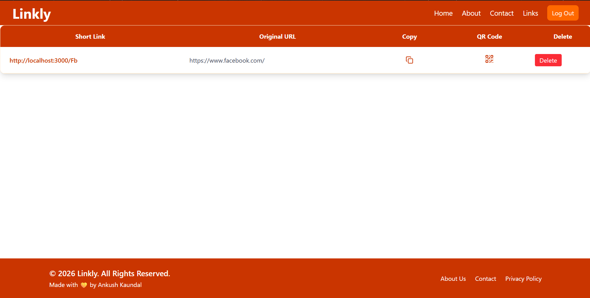
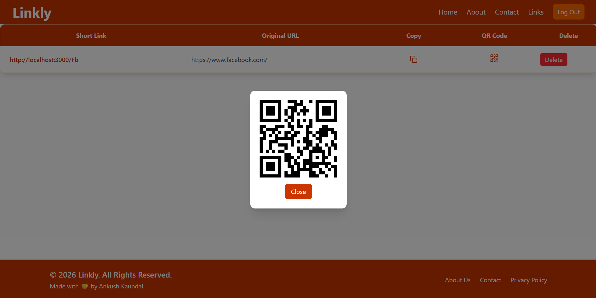
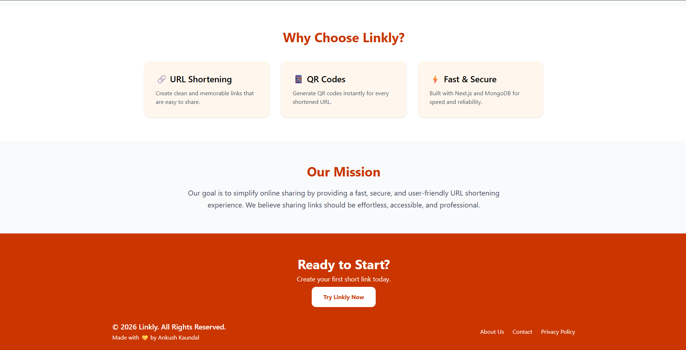
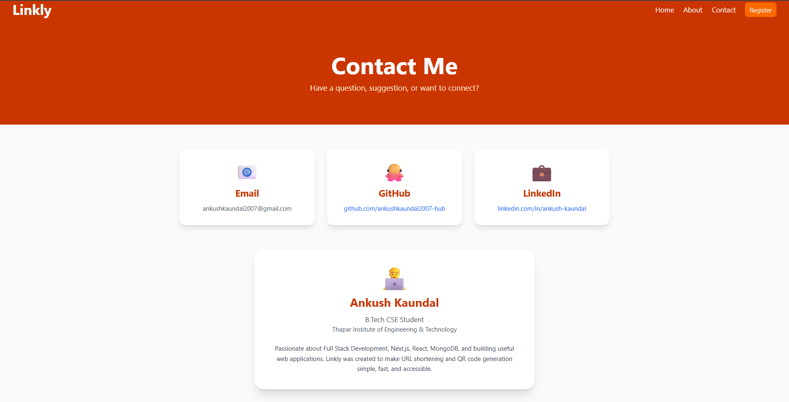

# 🔗 Linkly

<div align="center">

### Shorten. Share. Grow.

A modern full-stack URL shortening platform built with **Next.js**, **MongoDB**, **NextAuth**, and **Tailwind CSS**.

Create custom short links, generate QR codes instantly, and manage all your URLs from a personalized dashboard.

[Live Demo](#) • [Report Bug](#) • [Request Feature](#)

</div>

---

## ✨ Features

- 🔐 Google Authentication with NextAuth
- 🔗 Custom URL Shortening
- 📱 Instant QR Code Generation
- 📋 One-Click Copy to Clipboard
- 🗑️ Delete Links
- 👤 User-Specific Dashboard
- 📱 Fully Responsive Design
- ⚡ Fast Next.js App Router Architecture
- 🎨 Modern UI with Tailwind CSS
- ☁️ MongoDB Database Integration

---

## 🛠️ Tech Stack

### Frontend

- Next.js 16
- React
- Tailwind CSS

### Backend

- Next.js API Routes
- MongoDB
- Mongoose

### Authentication

- NextAuth.js
- Google OAuth

### Deployment

- Vercel

---

# 📸 Screenshots

## 🏠 Home Page




---

## 🔐 Login Page



---

## 🔗 URL Generator




---

## 📊 Dashboard




---

## 📱 QR Code Generation




---

## ℹ️ About Page



---

## 📞 Contact Page




---

# 🚀 Getting Started

## Clone Repository

```bash
git clone https://github.com/YOUR_USERNAME/linkly.git
```

```bash
cd linkly
```

## Install Dependencies

```bash
npm install
```

## Create Environment Variables

Create a `.env.local` file in the root directory.

```env
MONGODB_URI=

GOOGLE_ID=

GOOGLE_SECRET=

NEXT_PUBLIC_HOST=http://localhost:3000/
```

## Run Development Server

```bash
npm run dev
```

Open:

```text
http://localhost:3000
```

---

# 📂 Project Structure

```text
linkly/
│
├── app/
│   ├── api/
│   ├── about/
│   ├── contact/
│   ├── privacy/
│   ├── links/
│   └── url/
│
├── components/
│
├── models/
│
├── lib/
│
├── public/
│
└── README.md
```

---

# 🎯 Future Improvements

- 📈 Link Analytics
- 👁️ Click Tracking
- 🌙 Dark Mode
- 📥 Download QR Codes
- ⏳ Link Expiration
- ✏️ Edit Existing Links
- 🌐 Custom Domains

---

# 👨‍💻 Developer

### Ankush Kaundal

B.Tech CSE Student  
Thapar Institute of Engineering & Technology

Passionate about Full Stack Development, Web Technologies, and building practical software solutions.

---

# ⭐ Support

If you found this project useful, consider giving it a star.

It helps others discover the project and motivates future improvements.

---

<div align="center">

### Made with 💛 by Ankush Kaundal

**Linkly — Shorten. Share. Grow.**

</div>
